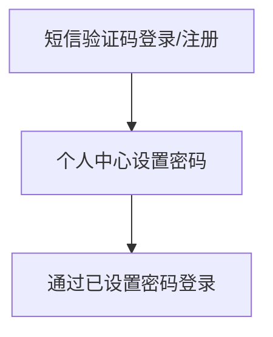

# 1. 账户注册/登录

用户可通过手机短信验证码注册并登录LLaMA-Factory Online账户。完成注册后，您可以在“[个人中心](https://docs.llamafactory.online/docs/documents/usercenter#操作步骤)”中设置密码，以便后续使用密码登录并操作LLaMA-Factory Online。操作详情如下：

## 1.1 短信注册/登录

1. 用户访问[LLaMA-Factory Online](https://www.llamafactory.online)官网，找到右上角“登录”按钮，如下图所示。

      
  
2. 单击“登录”按钮，进入[登录账户]页面，如下图所示。填写手机号，单击“获取验证码”。

      

3. 填写已获取的短信验证码，单击“登录/注册”按钮，即可完成LLaMA-Factory Online短信登录/注册操作。

> **重要**
>
> - 用户通过手机号登录时，未注册的手机号系统将自动注册。  
> - 用户点击“登录/注册”即视为您已阅读并同意用户协议、隐私政策。  
> - 当用户连续5次输入错误验证码后，系统将在10分钟内锁定该登录方式，期间用户将无法通过此途径登录LLaMA-Factory Online。

## 1.2 邀请登录
用户可在注册时，填写好友分享的邀请码，详情操作如下所示。
1. 用户访问[LLaMA-Factory Online](https://www.llamafactory.online)官网，找到右上角“登录”按钮，如下图所示。

      
  
2. 单击“登录”按钮，进入[登录账户]页面，如下图所示。填写手机号，单击“获取验证码”。

      
     

3. 填写已获取的短信验证码后，单击下方的“填写邀请码”按钮，如上图所示。随后填写好友分享的邀请码即可完成操作，如下图所示，邀请码获取方式请参考[邀请好友](/docs/documents/reward)。
      

## 1.3 设置登录密码
用户通过短信验证码完成注册/登录后，可自定义设置登录密码。后续即可使用该密码登录LLaMA-Factory Online。流程示意图及操作详情如下。

1. 通过手机验证码登录/注册[LLaMA-Factory Online](https://www.llamafactory.online)官网，选择右上角用户图标，单击“用户中心”菜单项进入用户中心信息详情页。

     

2. 点击“密码”处的图标，进入密码修改页面，例如下图所示，输入页面参数，参数说明如下所示。

     

* 新密码：配置LLaMA-Factory Online的登录密码，密码包含数字、字母和字符，长度为8-16个字符。
* 验证码：请填写通过本页面手机号接收到的6位数字验证码。
 
3. 参数配置完成后，单击“确定”按钮，即可完成密码设置操作。

## 1.4 密码登录

用户可使用已设置的密码登录LLaMA-Factory Online平台，操作详情如下所示。

> **提示**
> 
> 用户已完成登录密码的设置，操作详情可参见上一章节。

1. 用户访问[LLaMA-Factory Online](https://www.llamafactory.online)官网，单击右上角“登录”按钮，系统默认进入短信登录/注册页面。
  
2. 切换至“密码”页面，如下图所示，使用已设置的密码登录LLaMA-Factory Online。

     

> **重要**
> 
> 当用户连续5次输入错误密码后，系统将在10分钟内锁定该登录方式，期间用户将无法通过此途径登录LLaMA-Factory Online。

## 1.5 忘记密码

用户忘记密码后，可通过以下方式重置密码，操作详情如下所示。

1. 用户访问[LLaMA-Factory Online](https://www.llamafactory.online)官网，单击右上角“登录”按钮，系统默认进入短信登录/注册页面。

2. 切换至“密码”页面，如上图所示，点击“忘记密码”链接，进入密码重置页面，如下图所示。根据页面要求配置对应参数，参数说明如下所示。

     

* 手机号：填写已经注册的手机号。
* 新密码：配置LLaMA-Factory Online的登录密码，密码包含数字、字母和字符，长度为8-16个字符。
* 验证码：请填写通过本页面手机号接收到的6位数字验证码。