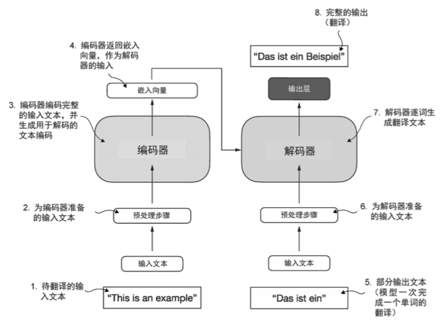

# 第二章 Transformer 架构

## 1. Transformer的历史意义与技术革命

Transformer架构的提出标志着深度学习领域的一个重要转折点。2017年，Google的研究团队在论文《Attention Is All You Need》中首次提出了这一革命性的架构，该架构最初是为机器翻译任务开发的，其简化版本如下图所示。在Transformer出现之前，循环神经网络（RNN）和长短期记忆网络（LSTM）一直是序列建模的主流方法，但它们存在着训练速度慢、难以并行化、长距离依赖建模困难等问题。

**技术背景与动机**：传统的序列到序列模型主要依赖于循环结构来处理序列数据，这种串行的计算方式不仅限制了训练效率，还容易出现梯度消失和梯度爆炸问题。卷积神经网络虽然可以并行计算，但在处理长距离依赖时需要堆叠多层，计算复杂度较高。Transformer的核心创新在于完全摒弃了循环和卷积结构，仅仅依靠注意力机制来建模序列中元素之间的关系。

**架构创新的核心思想**：Transformer的设计哲学可以概括为"注意力即一切"（Attention Is All You Need）。通过自注意力机制，模型能够直接计算序列中任意两个位置之间的关系，无论它们相距多远。这种设计不仅解决了长距离依赖问题，还使得模型可以高度并行化，大大提升了训练效率。

**影响与应用**：Transformer架构的影响远远超出了最初的机器翻译任务。它成为了现代大语言模型的基础架构，从BERT到GPT，从T5到ChatGPT，几乎所有的先进语言模型都基于Transformer架构。更重要的是，Transformer的成功证明了注意力机制的强大能力，为后续的多模态学习、计算机视觉等领域的发展提供了重要启示。

通过本章的学习，用户将深入理解Transformer架构的核心组件和工作原理，掌握注意力机制的数学原理和实现细节，学会如何从零开始构建一个完整的Transformer模型，并了解如何将其应用到实际的NLP任务中。本章不仅会提供详细的理论分析，还会通过丰富的代码示例帮助用户获得实践经验。

