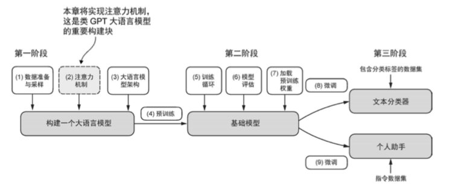
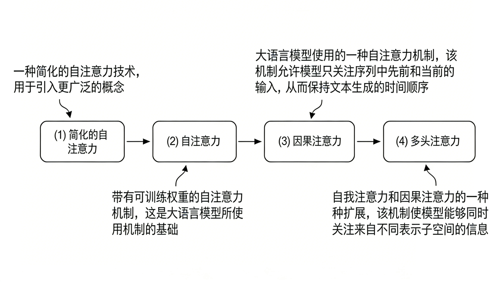

# 1. 注意力机制

## 1.1 注意力机制的直观理解

注意力机制的灵感来源于人类的认知过程。当我们阅读一段文字或观察一个场景时，我们的注意力会自然地聚焦在最相关的信息上，而忽略不重要的细节。在深度学习中，注意力机制试图模拟这种选择性关注的能力，让模型能够动态地决定应该关注输入的哪些部分，如下图所示。



**传统方法的局限性**：在Transformer出现之前，序列到序列模型通常使用固定大小的上下文向量来编码整个输入序列的信息。这种方法存在明显的信息瓶颈问题：无论输入序列多长，都要压缩到一个固定维度的向量中，这必然会导致信息丢失，特别是对于长序列而言。

**注意力机制的核心思想**：注意力机制通过计算查询（Query）与键（Key）之间的相似度来确定注意力权重，然后使用这些权重对值（Value）进行加权求和。这种机制允许模型在处理每个输出位置时，动态地关注输入序列的不同部分，从而有效地解决了信息瓶颈问题。

**数学表述**：注意力机制的数学表达可以写为：
```
Attention(Q, K, V) = softmax(QK^T / √d_k)V
```
其中，Q、K、V分别代表查询、键和值矩阵，d_k是键向量的维度，用于缩放以防止softmax函数进入饱和区域。

## 1.2 自注意力机制的深度解析

自注意力（Self-Attention）是Transformer架构的核心创新，它允许序列中的每个位置都能够关注到序列中的所有位置，包括它自己。这种机制使得模型能够捕捉序列内部的复杂依赖关系。

**自注意力的工作流程**：
1. **线性变换**：将输入序列通过三个不同的线性变换得到Q、K、V矩阵
2. **相似度计算**：计算每个查询与所有键之间的点积相似度
3. **注意力权重**：通过softmax函数将相似度转换为概率分布
4. **加权求和**：使用注意力权重对值进行加权求和得到输出

**多头注意力的优势**：单一的注意力头可能只能捕捉到一种类型的关系，而多头注意力通过并行计算多个注意力头，能够同时关注不同类型的信息。每个注意力头都有自己的Q、K、V变换矩阵，可以学习到不同的表示子空间。

```python
import torch
import torch.nn as nn
import torch.nn.functional as F
import math
import numpy as np
import matplotlib.pyplot as plt

class ScaledDotProductAttention(nn.Module):
    """缩放点积注意力机制"""
    
    def __init__(self, dropout=0.1):
        super(ScaledDotProductAttention, self).__init__()
        self.dropout = nn.Dropout(dropout)
        
    def forward(self, query, key, value, mask=None, temperature=1.0):
        """
        Args:
            query: [batch_size, seq_len, d_k]
            key: [batch_size, seq_len, d_k]  
            value: [batch_size, seq_len, d_v]
            mask: [batch_size, seq_len, seq_len]
            temperature: 温度参数，用于控制注意力分布的尖锐程度
        """
        batch_size, seq_len, d_k = query.size()
        
        # 计算注意力分数
        scores = torch.matmul(query, key.transpose(-2, -1)) / (math.sqrt(d_k) * temperature)
        
        # 应用掩码（如果提供）
        if mask is not None:
            scores = scores.masked_fill(mask == 0, -1e9)
        
        # 计算注意力权重
        attention_weights = F.softmax(scores, dim=-1)
        attention_weights = self.dropout(attention_weights)
        
        # 应用注意力权重到值
        context = torch.matmul(attention_weights, value)
        
        return context, attention_weights

class MultiHeadAttention(nn.Module):
    """多头注意力机制"""
    
    def __init__(self, d_model, n_heads, dropout=0.1):
        super(MultiHeadAttention, self).__init__()
        assert d_model % n_heads == 0
        
        self.d_model = d_model
        self.n_heads = n_heads
        self.d_k = d_model // n_heads
        
        # 线性变换层
        self.w_q = nn.Linear(d_model, d_model, bias=False)
        self.w_k = nn.Linear(d_model, d_model, bias=False)
        self.w_v = nn.Linear(d_model, d_model, bias=False)
        self.w_o = nn.Linear(d_model, d_model)
        
        # 注意力机制
        self.attention = ScaledDotProductAttention(dropout)
        
        # 初始化权重
        self.init_weights()
    
    def init_weights(self):
        """初始化权重"""
        for module in [self.w_q, self.w_k, self.w_v, self.w_o]:
            nn.init.xavier_uniform_(module.weight)
    
    def forward(self, query, key, value, mask=None):
        batch_size, seq_len, d_model = query.size()
        
        # 1. 线性变换并重塑为多头形式
        Q = self.w_q(query).view(batch_size, seq_len, self.n_heads, self.d_k).transpose(1, 2)
        K = self.w_k(key).view(batch_size, seq_len, self.n_heads, self.d_k).transpose(1, 2)
        V = self.w_v(value).view(batch_size, seq_len, self.n_heads, self.d_k).transpose(1, 2)
        
        # 2. 调整掩码维度以匹配多头
        if mask is not None:
            mask = mask.unsqueeze(1).repeat(1, self.n_heads, 1, 1)
        
        # 3. 应用注意力机制
        context, attention_weights = self.attention(Q, K, V, mask)
        
        # 4. 连接多头输出
        context = context.transpose(1, 2).contiguous().view(
            batch_size, seq_len, d_model
        )
        
        # 5. 最终线性变换
        output = self.w_o(context)
        
        return output, attention_weights
    
    def visualize_attention(self, attention_weights, tokens=None, head_idx=0):
        """可视化注意力权重"""
        # 选择第一个样本和指定的注意力头
        attn = attention_weights[0, head_idx].detach().cpu().numpy()
        
        plt.figure(figsize=(10, 8))
        plt.imshow(attn, cmap='Blues', interpolation='nearest')
        plt.colorbar()
        
        if tokens is not None:
            plt.xticks(range(len(tokens)), tokens, rotation=45)
            plt.yticks(range(len(tokens)), tokens)
        
        plt.title(f'Attention Weights (Head {head_idx})')
        plt.xlabel('Key Positions')
        plt.ylabel('Query Positions')
        plt.tight_layout()
        plt.show()

class PositionalEncoding(nn.Module):
    """位置编码"""
    
    def __init__(self, d_model, max_len=5000, dropout=0.1):
        super(PositionalEncoding, self).__init__()
        self.dropout = nn.Dropout(dropout)
        
        # 创建位置编码矩阵
        pe = torch.zeros(max_len, d_model)
        position = torch.arange(0, max_len, dtype=torch.float).unsqueeze(1)
        
        # 计算除数项
        div_term = torch.exp(torch.arange(0, d_model, 2).float() * 
                           (-math.log(10000.0) / d_model))
        
        # 应用sin和cos函数
        pe[:, 0::2] = torch.sin(position * div_term)
        pe[:, 1::2] = torch.cos(position * div_term)
        
        # 添加批次维度并注册为缓冲区
        pe = pe.unsqueeze(0).transpose(0, 1)
        self.register_buffer('pe', pe)
    
    def forward(self, x):
        """
        Args:
            x: [seq_len, batch_size, d_model]
        """
        x = x + self.pe[:x.size(0), :]
        return self.dropout(x)

def demonstrate_attention_mechanism():
    """演示注意力机制的工作原理"""
    
    # 设置参数
    batch_size = 2
    seq_len = 8
    d_model = 512
    n_heads = 8
    
    # 创建示例输入
    x = torch.randn(batch_size, seq_len, d_model)
    
    # 创建多头注意力层
    mha = MultiHeadAttention(d_model, n_heads)
    
    # 前向传播
    output, attention_weights = mha(x, x, x)  # 自注意力
    
    print("=== 注意力机制演示 ===")
    print(f"输入形状: {x.shape}")
    print(f"输出形状: {output.shape}")
    print(f"注意力权重形状: {attention_weights.shape}")
    
    # 分析注意力权重的统计特性
    attn_mean = attention_weights.mean().item()
    attn_std = attention_weights.std().item()
    attn_max = attention_weights.max().item()
    attn_min = attention_weights.min().item()
    
    print(f"\n注意力权重统计:")
    print(f"  均值: {attn_mean:.4f}")
    print(f"  标准差: {attn_std:.4f}")
    print(f"  最大值: {attn_max:.4f}")
    print(f"  最小值: {attn_min:.4f}")
    
    # 验证注意力权重是否为概率分布
    attn_sum = attention_weights.sum(dim=-1)
    print(f"  权重和 (应该接近1): {attn_sum[0, 0, 0].item():.4f}")
    
    return mha, attention_weights

# 运行演示
mha_demo, attn_weights = demonstrate_attention_mechanism()
```

## 1.3 注意力机制的变种与优化
不同的注意力的实现是从一个简化版本的自注意力机制开始，然后逐步加入可训练的权重。因果注意力机制在自注意力的基础上增加了额外掩码，使得大语言模型可以一次生成一个单词。最后，多头注意力将注意力机制划分成多个头，从而使模型能够并行捕获输人数据的各种特征，如下图所示。


**相对位置编码**：传统的绝对位置编码在处理不同长度的序列时可能存在泛化问题。相对位置编码通过建模相对位置关系来解决这个问题，使得模型能够更好地处理可变长度的序列。

**稀疏注意力**：标准的自注意力机制的计算复杂度是O(n²)，对于长序列来说计算成本很高。稀疏注意力通过限制每个位置只关注部分位置来降低计算复杂度，常见的模式包括局部注意力、条纹注意力等。

**线性注意力**：通过数学变换将注意力计算的复杂度从O(n²)降低到O(n)，使得模型能够处理更长的序列。

```python
class RelativePositionAttention(nn.Module):
    """相对位置注意力机制"""
    
    def __init__(self, d_model, n_heads, max_relative_position=128):
        super(RelativePositionAttention, self).__init__()
        self.d_model = d_model
        self.n_heads = n_heads
        self.d_k = d_model // n_heads
        self.max_relative_position = max_relative_position
        
        # 标准的Q, K, V变换
        self.w_q = nn.Linear(d_model, d_model, bias=False)
        self.w_k = nn.Linear(d_model, d_model, bias=False)
        self.w_v = nn.Linear(d_model, d_model, bias=False)
        self.w_o = nn.Linear(d_model, d_model)
        
        # 相对位置编码
        self.relative_position_k = nn.Embedding(
            2 * max_relative_position + 1, self.d_k
        )
        self.relative_position_v = nn.Embedding(
            2 * max_relative_position + 1, self.d_k
        )
    
    def _get_relative_positions(self, seq_len):
        """生成相对位置矩阵"""
        range_vec = torch.arange(seq_len)
        range_mat = range_vec.unsqueeze(0).repeat(seq_len, 1)
        distance_mat = range_mat - range_mat.transpose(0, 1)
        
        # 裁剪到最大相对位置
        distance_mat_clipped = torch.clamp(
            distance_mat, -self.max_relative_position, self.max_relative_position
        )
        
        # 转换为正数索引
        final_mat = distance_mat_clipped + self.max_relative_position
        return final_mat
    
    def forward(self, query, key, value, mask=None):
        batch_size, seq_len, d_model = query.size()
        
        # 标准的Q, K, V变换
        Q = self.w_q(query).view(batch_size, seq_len, self.n_heads, self.d_k).transpose(1, 2)
        K = self.w_k(key).view(batch_size, seq_len, self.n_heads, self.d_k).transpose(1, 2)
        V = self.w_v(value).view(batch_size, seq_len, self.n_heads, self.d_k).transpose(1, 2)
        
        # 计算标准注意力分数
        scores = torch.matmul(Q, K.transpose(-2, -1)) / math.sqrt(self.d_k)
        
        # 添加相对位置信息
        relative_positions = self._get_relative_positions(seq_len).to(query.device)
        relative_position_scores_k = self.relative_position_k(relative_positions)
        relative_position_scores_k = relative_position_scores_k.permute(2, 0, 1).unsqueeze(0)
        
        # 计算相对位置注意力分数
        relative_scores = torch.matmul(Q.unsqueeze(-2), relative_position_scores_k.unsqueeze(1))
        relative_scores = relative_scores.squeeze(-2)
        
        # 合并分数
        scores = scores + relative_scores
        
        # 应用掩码和softmax
        if mask is not None:
            scores = scores.masked_fill(mask == 0, -1e9)
        
        attention_weights = F.softmax(scores, dim=-1)
        
        # 应用注意力权重
        context = torch.matmul(attention_weights, V)
        
        # 重塑输出
        context = context.transpose(1, 2).contiguous().view(batch_size, seq_len, d_model)
        output = self.w_o(context)
        
        return output, attention_weights

class SparseAttention(nn.Module):
    """稀疏注意力机制"""
    
    def __init__(self, d_model, n_heads, window_size=64, stride=32):
        super(SparseAttention, self).__init__()
        self.d_model = d_model
        self.n_heads = n_heads
        self.d_k = d_model // n_heads
        self.window_size = window_size
        self.stride = stride
        
        self.w_q = nn.Linear(d_model, d_model, bias=False)
        self.w_k = nn.Linear(d_model, d_model, bias=False)
        self.w_v = nn.Linear(d_model, d_model, bias=False)
        self.w_o = nn.Linear(d_model, d_model)
    
    def _create_sparse_mask(self, seq_len):
        """创建稀疏注意力掩码"""
        mask = torch.zeros(seq_len, seq_len)
        
        # 局部窗口注意力
        for i in range(seq_len):
            start = max(0, i - self.window_size // 2)
            end = min(seq_len, i + self.window_size // 2 + 1)
            mask[i, start:end] = 1
        
        # 条纹注意力（每隔stride个位置关注一次）
        for i in range(0, seq_len, self.stride):
            mask[:, i] = 1
            mask[i, :] = 1
        
        return mask
    
    def forward(self, query, key, value, mask=None):
        batch_size, seq_len, d_model = query.size()
        
        # 创建稀疏掩码
        sparse_mask = self._create_sparse_mask(seq_len).to(query.device)
        if mask is not None:
            sparse_mask = sparse_mask * mask
        
        # 标准的多头注意力计算
        Q = self.w_q(query).view(batch_size, seq_len, self.n_heads, self.d_k).transpose(1, 2)
        K = self.w_k(key).view(batch_size, seq_len, self.n_heads, self.d_k).transpose(1, 2)
        V = self.w_v(value).view(batch_size, seq_len, self.n_heads, self.d_k).transpose(1, 2)
        
        scores = torch.matmul(Q, K.transpose(-2, -1)) / math.sqrt(self.d_k)
        
        # 应用稀疏掩码
        sparse_mask = sparse_mask.unsqueeze(0).unsqueeze(0).expand(batch_size, self.n_heads, -1, -1)
        scores = scores.masked_fill(sparse_mask == 0, -1e9)
        
        attention_weights = F.softmax(scores, dim=-1)
        context = torch.matmul(attention_weights, V)
        
        context = context.transpose(1, 2).contiguous().view(batch_size, seq_len, d_model)
        output = self.w_o(context)
        
        return output, attention_weights

def compare_attention_mechanisms():
    """比较不同注意力机制的性能"""
    
    batch_size = 1
    seq_len = 128
    d_model = 512
    n_heads = 8
    
    x = torch.randn(batch_size, seq_len, d_model)
    
    # 标准多头注意力
    standard_attn = MultiHeadAttention(d_model, n_heads)
    
    # 相对位置注意力
    relative_attn = RelativePositionAttention(d_model, n_heads)
    
    # 稀疏注意力
    sparse_attn = SparseAttention(d_model, n_heads)
    
    mechanisms = {
        'Standard': standard_attn,
        'Relative Position': relative_attn,
        'Sparse': sparse_attn
    }
    
    print("=== 注意力机制性能比较 ===")
    
    for name, mechanism in mechanisms.items():
        import time
        
        # 预热
        for _ in range(5):
            _ = mechanism(x, x, x)
        
        # 计时
        start_time = time.time()
        for _ in range(10):
            output, attn_weights = mechanism(x, x, x)
        end_time = time.time()
        
        avg_time = (end_time - start_time) / 10
        
        print(f"{name}:")
        print(f"  平均执行时间: {avg_time:.4f}s")
        print(f"  输出形状: {output.shape}")
        print(f"  注意力权重形状: {attn_weights.shape}")
        print()

# 运行比较
compare_attention_mechanisms()
```


