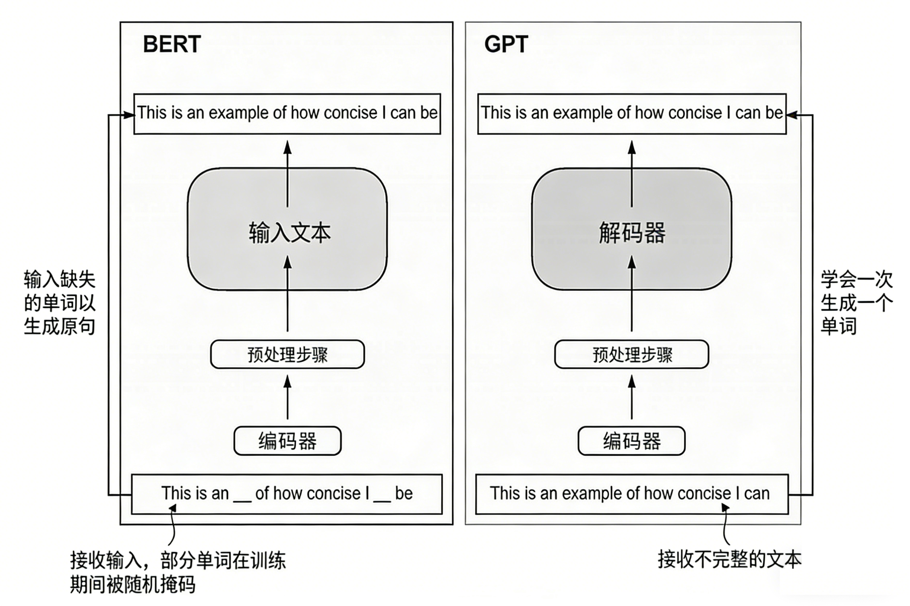

## 3. Encoder-Decoder：序列转换的经典架构

### 3.1 Encoder-Decoder架构的设计理念

Encoder-Decoder架构是Transformer的核心组成部分，它将序列到序列的转换任务分解为两个阶段：编码阶段和解码阶段。这种设计不仅清晰地分离了理解和生成的过程，还为各种NLP任务提供了统一的框架。

**编码器的职责**：编码器负责理解和编码输入序列，将其转换为一系列连续的表示向量。每个编码器层都包含自注意力机制和前馈神经网络，通过多层的堆叠，编码器能够捕捉输入序列中的复杂模式和长距离依赖关系。

**解码器的职责**：解码器负责基于编码器的输出生成目标序列。解码器不仅包含自注意力机制，还包含编码器-解码器注意力机制，使得解码器能够在生成每个输出token时关注到输入序列的相关部分。

**交叉注意力的重要性**：编码器-解码器注意力（也称为交叉注意力）是连接编码器和解码器的桥梁。在这种注意力机制中，查询来自解码器，而键和值来自编码器，这使得解码器能够动态地从输入序列中提取相关信息。

### 3.2 编码器的详细实现

编码器由多个相同的层堆叠而成，每一层都包含两个主要组件：多头自注意力机制和位置前馈网络。这种设计使得编码器能够并行处理输入序列的所有位置，同时建模复杂的依赖关系。

**层归一化的作用**：Transformer使用层归一化（Layer Normalization）而不是批归一化（Batch Normalization），这是因为层归一化对序列长度的变化更加鲁棒，能够稳定训练过程并提高模型性能。

**残差连接的重要性**：残差连接允许梯度直接流过网络的深层，有效缓解了梯度消失问题，使得我们能够训练更深的网络。

```python
class PositionwiseFeedForward(nn.Module):
    """位置前馈网络"""
    
    def __init__(self, d_model, d_ff, dropout=0.1, activation='relu'):
        super(PositionwiseFeedForward, self).__init__()
        self.w_1 = nn.Linear(d_model, d_ff)
        self.w_2 = nn.Linear(d_ff, d_model)
        self.dropout = nn.Dropout(dropout)
        
        if activation == 'relu':
            self.activation = nn.ReLU()
        elif activation == 'gelu':
            self.activation = nn.GELU()
        elif activation == 'swish':
            self.activation = nn.SiLU()  # Swish激活函数
        else:
            raise ValueError(f"Unsupported activation: {activation}")
    
    def forward(self, x):
        return self.w_2(self.dropout(self.activation(self.w_1(x))))

class EncoderLayer(nn.Module):
    """Transformer编码器层"""
    
    def __init__(self, d_model, n_heads, d_ff, dropout=0.1, activation='relu'):
        super(EncoderLayer, self).__init__()
        self.self_attn = MultiHeadAttention(d_model, n_heads, dropout)
        self.feed_forward = PositionwiseFeedForward(d_model, d_ff, dropout, activation)
        self.norm1 = nn.LayerNorm(d_model)
        self.norm2 = nn.LayerNorm(d_model)
        self.dropout = nn.Dropout(dropout)
    
    def forward(self, x, mask=None):
        # 自注意力子层
        attn_output, attn_weights = self.self_attn(x, x, x, mask)
        x = self.norm1(x + self.dropout(attn_output))
        
        # 前馈网络子层
        ff_output = self.feed_forward(x)
        x = self.norm2(x + self.dropout(ff_output))
        
        return x, attn_weights

class TransformerEncoder(nn.Module):
    """Transformer编码器"""
    
    def __init__(self, vocab_size, d_model, n_heads, n_layers, d_ff, 
                 max_len=5000, dropout=0.1, activation='relu'):
        super(TransformerEncoder, self).__init__()
        self.d_model = d_model
        self.embedding = nn.Embedding(vocab_size, d_model)
        self.pos_encoding = PositionalEncoding(d_model, max_len, dropout)
        
        self.layers = nn.ModuleList([
            EncoderLayer(d_model, n_heads, d_ff, dropout, activation)
            for _ in range(n_layers)
        ])
        
        self.norm = nn.LayerNorm(d_model)
        
    def forward(self, src, src_mask=None):
        # 词嵌入和位置编码
        x = self.embedding(src) * math.sqrt(self.d_model)
        x = x.transpose(0, 1)  # [seq_len, batch_size, d_model]
        x = self.pos_encoding(x)
        x = x.transpose(0, 1)  # [batch_size, seq_len, d_model]
        
        # 通过编码器层
        attention_weights = []
        for layer in self.layers:
            x, attn_weights = layer(x, src_mask)
            attention_weights.append(attn_weights)
        
        x = self.norm(x)
        
        return x, attention_weights

def create_padding_mask(seq, pad_idx=0):
    """创建填充掩码"""
    return (seq != pad_idx).unsqueeze(1).unsqueeze(2)

def demonstrate_encoder():
    """演示编码器的工作过程"""
    
    # 参数设置
    vocab_size = 10000
    d_model = 512
    n_heads = 8
    n_layers = 6
    d_ff = 2048
    max_len = 100
    batch_size = 2
    seq_len = 20
    
    # 创建编码器
    encoder = TransformerEncoder(
        vocab_size, d_model, n_heads, n_layers, d_ff, max_len
    )
    
    # 创建示例输入
    src = torch.randint(1, vocab_size, (batch_size, seq_len))
    src_mask = create_padding_mask(src)
    
    # 前向传播
    encoder_output, attention_weights = encoder(src, src_mask)
    
    print("=== 编码器演示 ===")
    print(f"输入形状: {src.shape}")
    print(f"输入掩码形状: {src_mask.shape}")
    print(f"编码器输出形状: {encoder_output.shape}")
    print(f"注意力权重层数: {len(attention_weights)}")
    print(f"每层注意力权重形状: {attention_weights[0].shape}")
    
    # 分析编码器输出的统计特性
    output_mean = encoder_output.mean().item()
    output_std = encoder_output.std().item()
    output_max = encoder_output.max().item()
    output_min = encoder_output.min().item()
    
    print(f"\n编码器输出统计:")
    print(f"  均值: {output_mean:.4f}")
    print(f"  标准差: {output_std:.4f}")
    print(f"  最大值: {output_max:.4f}")
    print(f"  最小值: {output_min:.4f}")
    
    return encoder, encoder_output, attention_weights

# 运行编码器演示
encoder_demo, enc_output, enc_attn = demonstrate_encoder()
```

### 3.3 解码器的详细实现

解码器的结构比编码器更复杂，因为它需要处理自回归生成的特殊要求。解码器的每一层包含三个主要组件：掩码自注意力、编码器-解码器注意力和位置前馈网络。

**掩码自注意力**：在解码过程中，模型只能看到当前位置之前的信息，不能看到未来的信息。这通过因果掩码（causal mask）来实现，确保模型在训练和推理时的行为一致。

**编码器-解码器注意力**：这是解码器独有的组件，它允许解码器在生成每个输出token时关注输入序列的相关部分。这种机制是实现序列到序列转换的关键。

```python
class DecoderLayer(nn.Module):
    """Transformer解码器层"""
    
    def __init__(self, d_model, n_heads, d_ff, dropout=0.1, activation='relu'):
        super(DecoderLayer, self).__init__()
        self.self_attn = MultiHeadAttention(d_model, n_heads, dropout)
        self.cross_attn = MultiHeadAttention(d_model, n_heads, dropout)
        self.feed_forward = PositionwiseFeedForward(d_model, d_ff, dropout, activation)
        
        self.norm1 = nn.LayerNorm(d_model)
        self.norm2 = nn.LayerNorm(d_model)
        self.norm3 = nn.LayerNorm(d_model)
        self.dropout = nn.Dropout(dropout)
    
    def forward(self, x, encoder_output, src_mask=None, tgt_mask=None):
        # 掩码自注意力子层
        self_attn_output, self_attn_weights = self.self_attn(x, x, x, tgt_mask)
        x = self.norm1(x + self.dropout(self_attn_output))
        
        # 编码器-解码器注意力子层
        cross_attn_output, cross_attn_weights = self.cross_attn(
            x, encoder_output, encoder_output, src_mask
        )
        x = self.norm2(x + self.dropout(cross_attn_output))
        
        # 前馈网络子层
        ff_output = self.feed_forward(x)
        x = self.norm3(x + self.dropout(ff_output))
        
        return x, self_attn_weights, cross_attn_weights

class TransformerDecoder(nn.Module):
    """Transformer解码器"""
    
    def __init__(self, vocab_size, d_model, n_heads, n_layers, d_ff,
                 max_len=5000, dropout=0.1, activation='relu'):
        super(TransformerDecoder, self).__init__()
        self.d_model = d_model
        self.embedding = nn.Embedding(vocab_size, d_model)
        self.pos_encoding = PositionalEncoding(d_model, max_len, dropout)
        
        self.layers = nn.ModuleList([
            DecoderLayer(d_model, n_heads, d_ff, dropout, activation)
            for _ in range(n_layers)
        ])
        
        self.norm = nn.LayerNorm(d_model)
        self.output_projection = nn.Linear(d_model, vocab_size)
        
    def forward(self, tgt, encoder_output, src_mask=None, tgt_mask=None):
        # 词嵌入和位置编码
        x = self.embedding(tgt) * math.sqrt(self.d_model)
        x = x.transpose(0, 1)  # [seq_len, batch_size, d_model]
        x = self.pos_encoding(x)
        x = x.transpose(0, 1)  # [batch_size, seq_len, d_model]
        
        # 通过解码器层
        self_attention_weights = []
        cross_attention_weights = []
        
        for layer in self.layers:
            x, self_attn, cross_attn = layer(x, encoder_output, src_mask, tgt_mask)
            self_attention_weights.append(self_attn)
            cross_attention_weights.append(cross_attn)
        
        x = self.norm(x)
        output = self.output_projection(x)
        
        return output, self_attention_weights, cross_attention_weights

def create_causal_mask(size):
    """创建因果掩码（下三角矩阵）"""
    mask = torch.tril(torch.ones(size, size))
    return mask.unsqueeze(0).unsqueeze(0)  # [1, 1, size, size]

def demonstrate_decoder():
    """演示解码器的工作过程"""
    
    # 参数设置
    vocab_size = 10000
    d_model = 512
    n_heads = 8
    n_layers = 6
    d_ff = 2048
    batch_size = 2
    src_len = 20
    tgt_len = 15
    
    # 创建解码器
    decoder = TransformerDecoder(
        vocab_size, d_model, n_heads, n_layers, d_ff
    )
    
    # 创建示例输入
    tgt = torch.randint(1, vocab_size, (batch_size, tgt_len))
    encoder_output = torch.randn(batch_size, src_len, d_model)  # 模拟编码器输出
    
    # 创建掩码
    src_mask = torch.ones(batch_size, 1, 1, src_len)  # 假设没有填充
    tgt_mask = create_causal_mask(tgt_len)
    
    # 前向传播
    decoder_output, self_attn_weights, cross_attn_weights = decoder(
        tgt, encoder_output, src_mask, tgt_mask
    )
    
    print("=== 解码器演示 ===")
    print(f"目标输入形状: {tgt.shape}")
    print(f"编码器输出形状: {encoder_output.shape}")
    print(f"解码器输出形状: {decoder_output.shape}")
    print(f"自注意力权重层数: {len(self_attn_weights)}")
    print(f"交叉注意力权重层数: {len(cross_attn_weights)}")
    
    # 分析输出分布
    output_probs = F.softmax(decoder_output, dim=-1)
    top_k_probs, top_k_indices = torch.topk(output_probs[0, 0], k=5)
    
    print(f"\n第一个位置的top-5预测:")
    for i, (prob, idx) in enumerate(zip(top_k_probs, top_k_indices)):
        print(f"  {i+1}. Token {idx.item()}: {prob.item():.4f}")
    
    return decoder, decoder_output, self_attn_weights, cross_attn_weights

# 运行解码器演示
decoder_demo, dec_output, self_attn, cross_attn = demonstrate_decoder()
```

### 3.4 完整的Encoder-Decoder架构

将编码器和解码器组合起来，我们就得到了完整的Transformer模型，如下图所示。这个模型能够处理各种序列到序列的任务，如机器翻译、文本摘要、对话生成等。



```python
class Transformer(nn.Module):
    """完整的Transformer模型"""
    
    def __init__(self, src_vocab_size, tgt_vocab_size, d_model=512, n_heads=8,
                 n_layers=6, d_ff=2048, max_len=5000, dropout=0.1, activation='relu'):
        super(Transformer, self).__init__()
        
        self.encoder = TransformerEncoder(
            src_vocab_size, d_model, n_heads, n_layers, d_ff, max_len, dropout, activation
        )
        
        self.decoder = TransformerDecoder(
            tgt_vocab_size, d_model, n_heads, n_layers, d_ff, max_len, dropout, activation
        )
        
        self.d_model = d_model
        
        # 参数初始化
        self.init_parameters()
    
    def init_parameters(self):
        """初始化模型参数"""
        for p in self.parameters():
            if p.dim() > 1:
                nn.init.xavier_uniform_(p)
    
    def forward(self, src, tgt, src_mask=None, tgt_mask=None):
        # 编码
        encoder_output, encoder_attn = self.encoder(src, src_mask)
        
        # 解码
        decoder_output, decoder_self_attn, decoder_cross_attn = self.decoder(
            tgt, encoder_output, src_mask, tgt_mask
        )
        
        return {
            'output': decoder_output,
            'encoder_attention': encoder_attn,
            'decoder_self_attention': decoder_self_attn,
            'decoder_cross_attention': decoder_cross_attn
        }
    
    def encode(self, src, src_mask=None):
        """仅编码"""
        return self.encoder(src, src_mask)
    
    def decode(self, tgt, encoder_output, src_mask=None, tgt_mask=None):
        """仅解码"""
        return self.decoder(tgt, encoder_output, src_mask, tgt_mask)

def demonstrate_full_transformer():
    """演示完整的Transformer模型"""
    
    # 参数设置
    src_vocab_size = 10000
    tgt_vocab_size = 8000
    d_model = 512
    n_heads = 8
    n_layers = 6
    d_ff = 2048
    batch_size = 2
    src_len = 20
    tgt_len = 15
    
    # 创建模型
    model = Transformer(src_vocab_size, tgt_vocab_size, d_model, n_heads, n_layers, d_ff)
    
    # 计算参数量
    total_params = sum(p.numel() for p in model.parameters())
    trainable_params = sum(p.numel() for p in model.parameters() if p.requires_grad)
    
    print("=== 完整Transformer模型 ===")
    print(f"总参数量: {total_params:,}")
    print(f"可训练参数量: {trainable_params:,}")
    print(f"模型大小 (MB): {total_params * 4 / 1024 / 1024:.2f}")
    
    # 创建示例输入
    src = torch.randint(1, src_vocab_size, (batch_size, src_len))
    tgt = torch.randint(1, tgt_vocab_size, (batch_size, tgt_len))
    
    # 创建掩码
    src_mask = create_padding_mask(src)
    tgt_mask = create_causal_mask(tgt_len)
    
    # 前向传播
    outputs = model(src, tgt, src_mask, tgt_mask)
    
    print(f"\n输入源序列形状: {src.shape}")
    print(f"输入目标序列形状: {tgt.shape}")
    print(f"输出形状: {outputs['output'].shape}")
    
    # 分析不同类型的注意力权重
    print(f"\n注意力权重分析:")
    print(f"编码器注意力层数: {len(outputs['encoder_attention'])}")
    print(f"解码器自注意力层数: {len(outputs['decoder_self_attention'])}")
    print(f"解码器交叉注意力层数: {len(outputs['decoder_cross_attention'])}")
    
    return model, outputs

# 运行完整模型演示
full_model, model_outputs = demonstrate_full_transformer()
```
