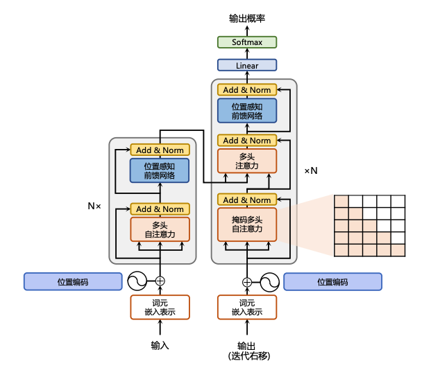

# 3. 搭建一个Transformer

## 3.1 整体模型架构
上述所有组件，再按照下图的 Tranfromer 结构拼接起来就是一个完整的 Transformer 模型了，如下图所示。



如图，经过 tokenizer 映射后的输出先经过 Embedding 层和 Positional Embedding 层编码，然后进入上一节讲过的 N 个 Encoder 和 N 个 Decoder（在 Transformer 原模型中，N 取为6），最后经过一个线性层和一个 Softmax 层就得到了最终输出。

基于之前所实现过的组件，我们实现完整的 Transformer 模型：

```python
class Transformer(nn.Module):
   '''整体模型'''
    def __init__(self, args):
        super().__init__()
        # 必须输入词表大小和 block size
        assert args.vocab_size is not None
        assert args.block_size is not None
        self.args = args
        self.transformer = nn.ModuleDict(dict(
            wte = nn.Embedding(args.vocab_size, args.n_embd),
            wpe = PositionalEncoding(args),
            drop = nn.Dropout(args.dropout),
            encoder = Encoder(args),
            decoder = Decoder(args),
        ))
        # 最后的线性层，输入是 n_embd，输出是词表大小
        self.lm_head = nn.Linear(args.n_embd, args.vocab_size, bias=False)

        # 初始化所有的权重
        self.apply(self._init_weights)

        # 查看所有参数的数量
        print("number of parameters: %.2fM" % (self.get_num_params()/1e6,))

    '''统计所有参数的数量'''
    def get_num_params(self, non_embedding=False):
        # non_embedding: 是否统计 embedding 的参数
        n_params = sum(p.numel() for p in self.parameters())
        # 如果不统计 embedding 的参数，就减去
        if non_embedding:
            n_params -= self.transformer.wte.weight.numel()
        return n_params

    '''初始化权重'''
    def _init_weights(self, module):
        # 线性层和 Embedding 层初始化为正则分布
        if isinstance(module, nn.Linear):
            torch.nn.init.normal_(module.weight, mean=0.0, std=0.02)
            if module.bias is not None:
                torch.nn.init.zeros_(module.bias)
        elif isinstance(module, nn.Embedding):
            torch.nn.init.normal_(module.weight, mean=0.0, std=0.02)
    
    '''前向计算函数'''
    def forward(self, idx, targets=None):
        # 输入为 idx，维度为 (batch size, sequence length, 1)；targets 为目标序列，用于计算 loss
        device = idx.device
        b, t = idx.size()
        assert t <= self.args.block_size, f"不能计算该序列，该序列长度为 {t}, 最大序列长度只有 {self.args.block_size}"

        # 通过 self.transformer
        # 首先将输入 idx 通过 Embedding 层，得到维度为 (batch size, sequence length, n_embd)
        print("idx",idx.size())
        # 通过 Embedding 层
        tok_emb = self.transformer.wte(idx)
        print("tok_emb",tok_emb.size())
        # 然后通过位置编码
        pos_emb = self.transformer.wpe(tok_emb) 
        # 再进行 Dropout
        x = self.transformer.drop(pos_emb)
        # 然后通过 Encoder
        print("x after wpe:",x.size())
        enc_out = self.transformer.encoder(x)
        print("enc_out:",enc_out.size())
        # 再通过 Decoder
        x = self.transformer.decoder(x, enc_out)
        print("x after decoder:",x.size())

        if targets is not None:
            # 训练阶段，如果我们给了 targets，就计算 loss
            # 先通过最后的 Linear 层，得到维度为 (batch size, sequence length, vocab size)
            logits = self.lm_head(x)
            # 再跟 targets 计算交叉熵
            loss = F.cross_entropy(logits.view(-1, logits.size(-1)), targets.view(-1), ignore_index=-1)
        else:
            # 推理阶段，我们只需要 logits，loss 为 None
            # 取 -1 是只取序列中的最后一个作为输出
            logits = self.lm_head(x[:, [-1], :]) # note: using list [-1] to preserve the time dim
            loss = None

        return logits, loss
```


经过上述步骤，我们就可以从零“手搓”一个完整的、可计算的 Transformer 模型。
## 3.2 总结与展望

### Transformer的核心价值：
1. **并行化能力**：相比RNN的串行计算，Transformer实现了高度并行化
2. **长距离依赖建模**：通过自注意力机制有效捕捉长距离依赖关系
3. **架构统一性**：为各种NLP任务提供了统一的架构框架
4. **可扩展性**：随着规模增长展现出强大的性能提升潜力

### 实践要点总结：
- 注意力机制是核心，理解其数学原理至关重要
- 位置编码解决了序列位置信息的问题
- 残差连接和层归一化保证了深层网络的训练稳定性
- 合适的超参数选择对模型性能影响巨大
- 评估和优化是持续改进的关键

### 未来发展方向：
- **效率优化**：稀疏注意力、线性注意力等降低计算复杂度
- **架构创新**：混合架构、多模态扩展等
- **应用拓展**：从NLP扩展到计算机视觉、语音等领域
- **理论理解**：深入理解Transformer的工作机制和表示能力

Transformer架构的成功不仅推动了NLP领域的快速发展，更为整个人工智能领域提供了重要启示。掌握Transformer的原理和实现，是理解现代深度学习模型的重要基础，也是进入大模型时代的必备技能。