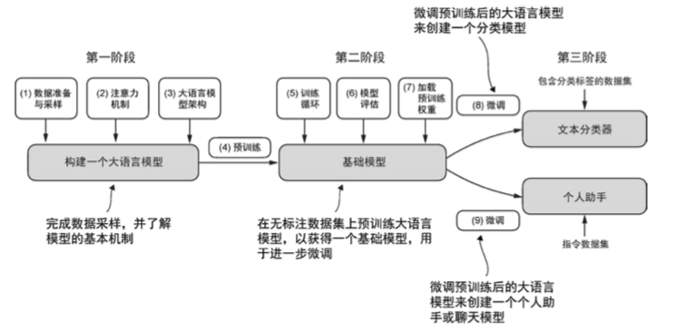

# 2. 如何训练一个LLM

## 2.1 训练数据的准备与处理

训练一个高质量的大语言模型，首先需要准备大规模、高质量的训练数据。数据的质量和规模直接决定了模型的最终性能。

**数据来源的多样性**：大语言模型的训练数据通常来自多个来源，包括：
- **网页文本**：如Common Crawl等大规模网页爬取数据
- **书籍和文学作品**：提供高质量的语言表达和知识内容
- **新闻文章**：提供时效性强的信息和标准的新闻写作风格
- **学术论文**：提供专业知识和严谨的表达方式
- **代码仓库**：如GitHub等平台的开源代码
- **百科全书**：如Wikipedia等结构化知识源

**数据清洗的重要性**：原始数据往往包含大量噪声，需要进行系统的清洗处理：
- **去重处理**：移除重复或近似重复的内容
- **质量过滤**：过滤掉低质量、垃圾或有害内容
- **格式标准化**：统一文本格式，处理编码问题
- **隐私保护**：移除个人敏感信息
- **版权合规**：确保数据使用符合版权要求

**数据预处理流程**：
- **分词处理**：将文本分解为模型可以处理的token
- **序列构建**：将token组织成固定长度的训练序列
- **特殊标记添加**：添加开始、结束、分隔等特殊标记
- **数据打包**：将处理后的数据打包成高效的训练格式

```python
import torch
import torch.nn as nn
from torch.utils.data import Dataset, DataLoader
import json
import re
from collections import Counter
import multiprocessing as mp
from tqdm import tqdm
import numpy as np

class LLMDataProcessor:
    """大语言模型数据处理器"""
    
    def __init__(self, tokenizer, max_length=1024):
        self.tokenizer = tokenizer
        self.max_length = max_length
        
    def clean_text(self, text):
        """文本清洗"""
        # 移除多余的空白字符
        text = re.sub(r'\s+', ' ', text)
        
        # 移除特殊字符（保留基本标点）
        text = re.sub(r'[^\w\s.,!?;:()\-\'""]', '', text)
        
        # 移除过短的文本
        if len(text.split()) < 10:
            return None
            
        return text.strip()
    
    def deduplicate_texts(self, texts, similarity_threshold=0.8):
        """文本去重"""
        from difflib import SequenceMatcher
        
        unique_texts = []
        for text in tqdm(texts, desc="去重处理"):
            is_duplicate = False
            for existing_text in unique_texts:
                similarity = SequenceMatcher(None, text, existing_text).ratio()
                if similarity > similarity_threshold:
                    is_duplicate = True
                    break
            
            if not is_duplicate:
                unique_texts.append(text)
        
        return unique_texts
    
    def filter_quality(self, texts):
        """质量过滤"""
        filtered_texts = []
        
        for text in texts:
            # 检查文本长度
            if len(text) < 100 or len(text) > 10000:
                continue
            
            # 检查语言质量（简单启发式）
            words = text.split()
            if len(words) < 20:
                continue
            
            # 检查重复词汇比例
            word_counts = Counter(words)
            unique_words = len(word_counts)
            if unique_words / len(words) < 0.3:  # 重复度过高
                continue
            
            # 检查大写字母比例
            upper_ratio = sum(1 for c in text if c.isupper()) / len(text)
            if upper_ratio > 0.3:  # 大写字母过多
                continue
            
            filtered_texts.append(text)
        
        return filtered_texts
    
    def create_training_sequences(self, texts):
        """创建训练序列"""
        sequences = []
        
        for text in tqdm(texts, desc="创建训练序列"):
            # 对文本进行编码
            tokens = self.tokenizer.encode(text, add_special_tokens=True)
            
            # 如果文本太长，分割成多个序列
            for i in range(0, len(tokens), self.max_length):
                sequence = tokens[i:i + self.max_length]
                
                # 确保序列长度足够
                if len(sequence) >= self.max_length // 2:
                    # 填充到固定长度
                    if len(sequence) < self.max_length:
                        sequence.extend([self.tokenizer.pad_token_id] * 
                                      (self.max_length - len(sequence)))
                    
                    sequences.append(sequence)
        
        return sequences
    
    def process_dataset(self, raw_texts, output_path):
        """处理完整数据集"""
        print(f"开始处理 {len(raw_texts)} 条原始文本...")
        
        # 1. 文本清洗
        print("步骤 1: 文本清洗")
        cleaned_texts = []
        for text in tqdm(raw_texts, desc="清洗文本"):
            cleaned = self.clean_text(text)
            if cleaned:
                cleaned_texts.append(cleaned)
        
        print(f"清洗后剩余 {len(cleaned_texts)} 条文本")
        
        # 2. 质量过滤
        print("步骤 2: 质量过滤")
        filtered_texts = self.filter_quality(cleaned_texts)
        print(f"过滤后剩余 {len(filtered_texts)} 条文本")
        
        # 3. 去重处理
        print("步骤 3: 去重处理")
        unique_texts = self.deduplicate_texts(filtered_texts)
        print(f"去重后剩余 {len(unique_texts)} 条文本")
        
        # 4. 创建训练序列
        print("步骤 4: 创建训练序列")
        sequences = self.create_training_sequences(unique_texts)
        print(f"生成 {len(sequences)} 个训练序列")
        
        # 5. 保存处理后的数据
        print("步骤 5: 保存数据")
        torch.save(sequences, output_path)
        
        # 统计信息
        stats = {
            'original_texts': len(raw_texts),
            'cleaned_texts': len(cleaned_texts),
            'filtered_texts': len(filtered_texts),
            'unique_texts': len(unique_texts),
            'training_sequences': len(sequences),
            'total_tokens': len(sequences) * self.max_length
        }
        
        return stats

class LLMDataset(Dataset):
    """大语言模型训练数据集"""
    
    def __init__(self, sequences):
        self.sequences = sequences
    
    def __len__(self):
        return len(self.sequences)
    
    def __getitem__(self, idx):
        sequence = self.sequences[idx]
        
        # 输入是除了最后一个token的所有token
        input_ids = torch.tensor(sequence[:-1], dtype=torch.long)
        
        # 标签是除了第一个token的所有token（用于下一个token预测）
        labels = torch.tensor(sequence[1:], dtype=torch.long)
        
        return {
            'input_ids': input_ids,
            'labels': labels
        }

def demonstrate_data_processing():
    """演示数据处理流程"""
    from transformers import GPT2Tokenizer
    
    # 初始化tokenizer
    tokenizer = GPT2Tokenizer.from_pretrained('gpt2')
    tokenizer.pad_token = tokenizer.eos_token
    
    # 创建数据处理器
    processor = LLMDataProcessor(tokenizer, max_length=512)
    
    # 示例原始数据
    raw_texts = [
        "This is a sample text for training a large language model. It contains multiple sentences and provides good training material.",
        "Another example text that demonstrates the data processing pipeline. This text is also suitable for language model training.",
        "Machine learning is a fascinating field that continues to evolve rapidly. Large language models represent a significant breakthrough.",
        "This is a duplicate text. This is a duplicate text. This is a duplicate text.",  # 低质量文本
        "Short text.",  # 过短文本
        "Natural language processing has made tremendous progress in recent years, thanks to advances in deep learning and transformer architectures."
    ]
    
    # 处理数据
    stats = processor.process_dataset(raw_texts, 'processed_data.pt')
    
    print("\n=== 数据处理统计 ===")
    for key, value in stats.items():
        print(f"{key}: {value}")
    
    # 加载处理后的数据
    sequences = torch.load('processed_data.pt')
    
    # 创建数据集
    dataset = LLMDataset(sequences)
    dataloader = DataLoader(dataset, batch_size=2, shuffle=True)
    
    # 查看一个批次的数据
    batch = next(iter(dataloader))
    print(f"\n=== 数据批次示例 ===")
    print(f"输入形状: {batch['input_ids'].shape}")
    print(f"标签形状: {batch['labels'].shape}")
    print(f"输入示例: {batch['input_ids'][0][:20]}")  # 显示前20个token
    
    return processor, dataset

# 运行数据处理演示
processor, dataset = demonstrate_data_processing()
```

## 2.2 模型架构设计与实现

大语言模型的架构设计是训练成功的关键。虽然大多数现代大语言模型都基于Transformer架构，但在具体实现上存在许多重要的设计选择，如下图所示。



**Transformer架构的核心组件**：
- **多头自注意力机制**：允许模型关注输入序列的不同位置
- **前馈神经网络**：提供非线性变换能力
- **层归一化**：稳定训练过程
- **残差连接**：缓解梯度消失问题
- **位置编码**：为模型提供位置信息

**关键设计决策**：
- **模型深度vs宽度**：更深的模型通常具有更强的表达能力，但训练难度也更大
- **注意力头数量**：影响模型的并行处理能力和表达能力
- **前馈网络维度**：通常是隐藏维度的4倍
- **激活函数选择**：如ReLU、GELU、SwiGLU等
- **归一化方式**：如LayerNorm、RMSNorm等

```python
import torch
import torch.nn as nn
import torch.nn.functional as F
import math

class MultiHeadAttention(nn.Module):
    def __init__(self, d_model, n_heads, dropout=0.1):
        super().__init__()
        assert d_model % n_heads == 0
        self.n_heads = n_heads
        self.d_k = d_model // n_heads
        
        self.w_q = nn.Linear(d_model, d_model, bias=False)
        self.w_k = nn.Linear(d_model, d_model, bias=False)
        self.w_v = nn.Linear(d_model, d_model, bias=False)
        self.w_o = nn.Linear(d_model, d_model)
        
        self.dropout = nn.Dropout(dropout)
        self.scale = math.sqrt(self.d_k)
    
    def forward(self, x, mask=None):
        B, L, D = x.shape
        Q = self.w_q(x).view(B, L, self.n_heads, self.d_k).transpose(1, 2)
        K = self.w_k(x).view(B, L, self.n_heads, self.d_k).transpose(1, 2)
        V = self.w_v(x).view(B, L, self.n_heads, self.d_k).transpose(1, 2)
        
        scores = torch.matmul(Q, K.transpose(-2, -1)) / self.scale
        if mask is not None:
            scores = scores.masked_fill(mask == 0, -1e9)
        
        attn = F.softmax(scores, dim=-1)
        attn = self.dropout(attn)
        context = torch.matmul(attn, V)
        
        context = context.transpose(1, 2).contiguous().view(B, L, D)
        return self.w_o(context), attn


class FeedForward(nn.Module):
    def __init__(self, d_model, d_ff, dropout=0.1):
        super().__init__()
        self.net = nn.Sequential(
            nn.Linear(d_model, d_ff),
            nn.GELU(),
            nn.Dropout(dropout),
            nn.Linear(d_ff, d_model)
        )
    
    def forward(self, x):
        return self.net(x)


class TransformerBlock(nn.Module):
    def __init__(self, d_model, n_heads, d_ff, dropout=0.1):
        super().__init__()
        self.attn = MultiHeadAttention(d_model, n_heads, dropout)
        self.ffn = FeedForward(d_model, d_ff, dropout)
        self.norm1 = nn.LayerNorm(d_model)
        self.norm2 = nn.LayerNorm(d_model)
        self.dropout = nn.Dropout(dropout)
    
    def forward(self, x, mask=None):
        attn_out, _ = self.attn(self.norm1(x), mask)
        x = x + self.dropout(attn_out)
        x = x + self.dropout(self.ffn(self.norm2(x)))
        return x


class PositionalEncoding(nn.Module):
    def __init__(self, d_model, max_len=512):
        super().__init__()
        pe = torch.zeros(max_len, d_model)
        pos = torch.arange(0, max_len).unsqueeze(1)
        div_term = torch.exp(torch.arange(0, d_model, 2) * (-math.log(10000.0) / d_model))
        pe[:, 0::2] = torch.sin(pos * div_term)
        pe[:, 1::2] = torch.cos(pos * div_term)
        self.register_buffer('pe', pe.unsqueeze(0))
    
    def forward(self, x):
        return x + self.pe[:, :x.size(1)]


class SimpleLLM(nn.Module):
    def __init__(self, vocab_size, d_model=512, n_heads=8, n_layers=6, d_ff=2048, max_len=512, dropout=0.1):
        super().__init__()
        self.token_emb = nn.Embedding(vocab_size, d_model)
        self.pos_enc = PositionalEncoding(d_model, max_len)
        self.layers = nn.ModuleList([
            TransformerBlock(d_model, n_heads, d_ff, dropout)
            for _ in range(n_layers)
        ])
        self.norm = nn.LayerNorm(d_model)
        self.lm_head = nn.Linear(d_model, vocab_size, bias=False)
        self.dropout = nn.Dropout(dropout)
        self.d_model = d_model
        
        # 权重共享
        self.lm_head.weight = self.token_emb.weight
    
    def create_causal_mask(self, seq_len):
        mask = torch.tril(torch.ones(seq_len, seq_len)).unsqueeze(0).unsqueeze(0)
        return mask
    
    def forward(self, input_ids, labels=None):
        B, L = input_ids.shape
        mask = self.create_causal_mask(L).to(input_ids.device)
        
        x = self.token_emb(input_ids) * math.sqrt(self.d_model)
        x = self.pos_enc(x)
        x = self.dropout(x)
        
        for layer in self.layers:
            x = layer(x, mask)
        
        x = self.norm(x)
        logits = self.lm_head(x)
        
        loss = None
        if labels is not None:
            shift_logits = logits[:, :-1].contiguous()
            shift_labels = labels[:, 1:].contiguous()
            loss = F.cross_entropy(
                shift_logits.view(-1, shift_logits.size(-1)),
                shift_labels.view(-1)
            )
        
        return {'logits': logits, 'loss': loss}
    
    def generate(self, input_ids, max_new_tokens=20, temperature=1.0):
        self.eval()
        with torch.no_grad():
            for _ in range(max_new_tokens):
                outputs = self(input_ids)
                logits = outputs['logits'][:, -1, :] / temperature
                probs = F.softmax(logits, dim=-1)
                next_token = torch.multinomial(probs, num_samples=1)
                input_ids = torch.cat([input_ids, next_token], dim=1)
        return input_ids


# 简易训练器

class SimpleTrainer:
    def __init__(self, model, train_loader, lr=1e-4, weight_decay=0.01, warmup_steps=100, total_steps=1000):
        self.model = model
        self.train_loader = train_loader
        self.device = torch.device('cuda' if torch.cuda.is_available() else 'cpu')
        self.model.to(self.device)
        
        optimizer_grouped_parameters = [
            {'params': [p for n, p in model.named_parameters() if 'bias' not in n], 'weight_decay': weight_decay},
            {'params': [p for n, p in model.named_parameters() if 'bias' in n], 'weight_decay': 0.0}
        ]
        self.optimizer = torch.optim.AdamW(optimizer_grouped_parameters, lr=lr, betas=(0.9, 0.95))
        
        def lr_lambda(step):
            if step < warmup_steps:
                return step / warmup_steps
            return max(0.0, (total_steps - step) / (total_steps - warmup_steps))
        self.scheduler = torch.optim.lr_scheduler.LambdaLR(self.optimizer, lr_lambda)
        
        self.total_steps = total_steps
    
    def train(self):
        self.model.train()
        step = 0
        while step < self.total_steps:
            for batch in self.train_loader:
                if step >= self.total_steps:
                    break
                input_ids = batch['input_ids'].to(self.device)
                labels = batch.get('labels', input_ids).to(self.device)
                
                self.optimizer.zero_grad()
                outputs = self.model(input_ids, labels)
                loss = outputs['loss']
                loss.backward()
                
                torch.nn.utils.clip_grad_norm_(self.model.parameters(), 1.0)
                self.optimizer.step()
                self.scheduler.step()
                
                if step % 100 == 0:
                    print(f"Step {step}, Loss: {loss.item():.4f}, LR: {self.scheduler.get_last_lr()[0]:.2e}")
                step += 1


# 示例：如何使用

if __name__ == "__main__":
    # 超参数
    vocab_size = 10000
    model = SimpleLLM(vocab_size=vocab_size, d_model=256, n_heads=4, n_layers=3, d_ff=1024)

    # 模拟数据集
    class DummyDataset(torch.utils.data.Dataset):
        def __len__(self): return 1000
        def __getitem__(self, _): 
            seq = torch.randint(0, vocab_size, (128,))
            return {'input_ids': seq}
    
    loader = torch.utils.data.DataLoader(DummyDataset(), batch_size=4, shuffle=True)

    # 训练
    trainer = SimpleTrainer(model, loader, lr=5e-4, total_steps=500)
    trainer.train()

    # 生成示例
    prompt = torch.randint(0, vocab_size, (1, 10))
    output = model.generate(prompt, max_new_tokens=15)
    print("Generated tokens:", output[0].tolist())
```

## 2.4 训练监控与调试

**关键监控指标**：
- **训练损失**：反映模型的学习进度
- **验证损失**：评估模型的泛化能力
- **困惑度**：语言模型的专用评估指标
- **学习率**：确保学习率调度正确
- **梯度范数**：监控梯度爆炸或消失
- **GPU利用率**：确保硬件资源充分利用

**常见问题与解决方案**：
- **损失不下降**：检查学习率、数据质量、模型初始化
- **训练不稳定**：调整学习率、增加梯度裁剪、检查数据
- **显存不足**：减少批次大小、使用梯度检查点、混合精度训练
- **训练速度慢**：优化数据加载、使用分布式训练、调整超参数

通过系统的训练流程和监控机制，我们可以成功训练出高质量的大语言模型。虽然训练大语言模型需要大量的计算资源和时间投入，但通过合理的架构设计、数据处理和训练策略，可以最大化训练效果，获得具有强大能力的语言模型。

训练大语言模型是一个复杂的系统工程，需要在数据、算法、系统等多个层面进行优化。随着技术的不断发展，训练方法也在持续改进，包括更高效的架构设计、更好的训练策略、更强大的硬件支持等。理解这些核心原理和实践方法，对于掌握大语言模型技术具有重要意义。