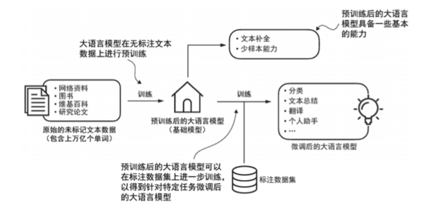

# 第五章 大模型微调

在人工智能快速发展的今天，预训练大模型如GPT、BERT、LLaMA等已经展现出令人惊叹的通用能力。这些模型通过在海量文本数据上进行预训练，学习到了丰富的语言知识、常识推理能力和世界知识。然而，尽管预训练模型具备强大的通用性，但在面对特定领域、特定任务时，往往会表现出"通用性强、针对性弱"的特点。大模型微调的核心价值在于解决这一矛盾。通过微调（Fine-tuning），我们可以在保持模型原有通用能力的基础上，使其针对特定任务进行优化，从而在垂直领域获得更好的表现，如下图所示。相比从零开始训练一个模型，微调具有以下显著优势：

首先，**成本大幅降低**。从零训练一个大模型需要数千块GPU、数周甚至数月的时间，以及TB级别的训练数据。而微调只需要少量GPU、数小时到数天的时间，以及相对较少的标注数据（通常几千到几万条即可）。这使得中小型企业和个人开发者也能够利用大模型的能力。

其次，**效果显著提升**。在特定任务上，经过微调的模型往往能够超越通用模型数十个百分点。例如，在医疗问答任务中，通用模型可能只有60%的准确率，而经过医疗数据微调后，准确率可以提升到85%以上。

第三，**快速适配部署**。微调使得我们能够在短时间内将通用模型转化为专用模型，快速响应业务需求。这种敏捷性在快速变化的市场环境中尤为重要。

**微调的适用场景**非常广泛，包括但不限于：垂直领域问答系统（如医疗咨询、法律咨询）、特定风格的内容生成（如营销文案、技术文档）、代码生成与补全、个性化对话系统、情感分析、文本分类等。几乎所有需要语言理解和生成的任务，都可以通过微调来提升效果。

然而，微调并非简单地"喂数据、跑训练"就能成功。它涉及到数据准备、方法选择、超参数调优、训练监控、效果评估等多个环节，每个环节都有其技巧和注意事项。本章将系统地介绍大模型微调的各种方法和最佳实践，帮助读者掌握这一关键技术。

