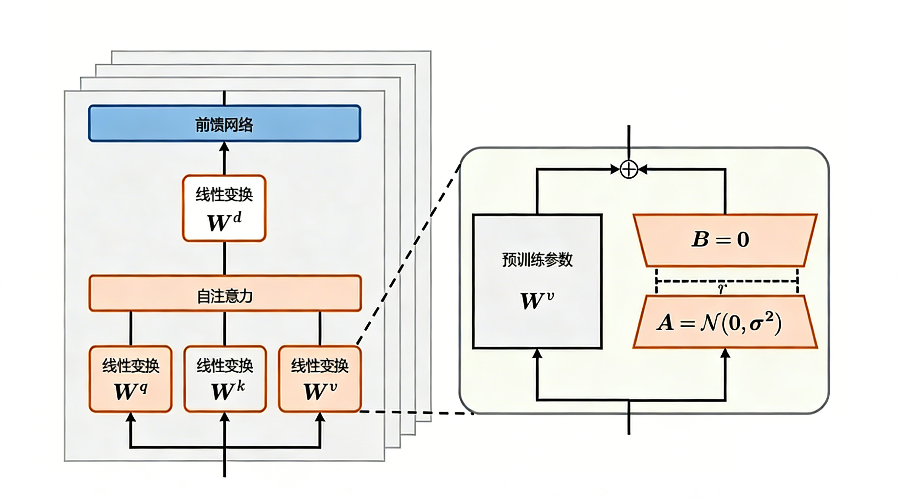

# 2. LoRA：参数高效的微调革命

## 2.1 LoRA的核心思想

LoRA（Low-Rank Adaptation）是近年来最受欢迎的参数高效微调方法之一，由Microsoft在2021年提出。它的核心思想非常巧妙：**不直接修改预训练模型的权重，而是在权重矩阵旁边添加低秩分解矩阵，只训练这些新增的小矩阵**。

为了理解LoRA的原理，我们需要先了解一个观察：在微调过程中，模型权重的更新往往是低秩的，即权重变化可以用少数几个主要方向来表示。基于这个观察，LoRA提出：假设原始权重矩阵为W，在微调时不直接更新W，而是添加一个低秩分解ΔW = BA，其中B和A是两个小矩阵，它们的秩远小于W的维度。

这种设计带来了巨大的优势。首先是**参数量大幅减少**。假设原始权重矩阵是768×768，如果直接微调需要更新约59万个参数。而使用LoRA，如果设置秩为8，只需要更新8×768×2约1.2万个参数，减少了98%！其次是**显存占用降低**。训练时只需要存储和更新小矩阵的梯度，大大降低了显存需求。第三是**推理无额外开销**。训练完成后，可以将BA合并到原始权重W中，推理时与原模型完全相同。第四是**可插拔性**。可以为不同任务训练不同的LoRA权重，快速切换，实现一个基础模型服务多个任务。

研究表明，语言模型针对特定任务微调之后，权重矩阵通常具有很低的本征秩（Intrinsic Rank）。研究人员认为参数更新量即便投影到较小的子空间中，也不会影响学习的有效性。因此，提出固定预训练模型参数不变，在原本权重矩阵旁路添加低秩矩阵的乘积作为可训练参数，用以模拟参数的变化量。LoRA 方法的计算流程如下图所示。



## 2.2 LoRA的关键参数

LoRA有几个关键参数需要仔细设置。**秩**是最重要的参数，它决定了LoRA的表达能力。秩越大，表达能力越强，但参数量也越多。一般来说，秩在4-64之间。对于简单任务（如文本分类），秩4-8就足够；对于中等复杂度任务（如问答、对话），秩8-16较合适；对于复杂任务（如复杂推理、专业领域生成），可以使用秩16-32甚至更大。

**alpha**控制LoRA更新的幅度。LoRA的实际缩放系数是alpha/rank。通常alpha设置为rank的1-2倍。如果alpha=rank，缩放系数为1；如果alpha=2×rank，缩放系数为2。较大的alpha意味着更激进的更新，较小的alpha则更保守。一般从alpha=rank开始尝试，如果收敛太慢可以增大，如果训练不稳定可以减小。

**目标模块**指定在哪些层应用LoRA。对于Transformer模型，通常在注意力层的Q、K、V、O投影上应用LoRA。最小配置是只在Q和V上应用，标准配置是Q、K、V，推荐配置是Q、K、V、O，完整配置还包括FFN层的投影。应用的模块越多，适配能力越强，但参数量也越多。

**dropout**用于防止过拟合。LoRA层的dropout通常设置为0.05-0.1。如果数据量较少或发现过拟合，可以增大dropout；如果训练不充分，可以减小或不使用dropout。

## 2.3 LoRA的实现与使用

使用Hugging Face的PEFT库可以非常方便地实现LoRA：

```python
from peft import LoraConfig, get_peft_model, TaskType

# 配置LoRA
lora_config = LoraConfig(
    r=8,  # 秩
    lora_alpha=16,  # 缩放因子
    target_modules=["q_proj", "k_proj", "v_proj", "o_proj"],  # 目标模块
    lora_dropout=0.05,  # dropout
    bias="none",  # 不训练bias
    task_type=TaskType.CAUSAL_LM  # 任务类型
)

# 应用LoRA到模型
model = get_peft_model(model, lora_config)

# 查看可训练参数
model.print_trainable_parameters()
# 输出类似：trainable params: 4,194,304 || all params: 6,742,609,920 || trainable%: 0.06%
```

可以看到，使用LoRA后，可训练参数只占总参数的0.06%，这就是参数高效的含义。

训练LoRA模型与训练普通模型基本相同，但有几点需要注意：首先，LoRA可以使用比全量微调更大的学习率，通常在1e-4到2e-4之间。其次，LoRA训练通常更快收敛，可以适当减少训练轮数。第三，LoRA对批次大小不太敏感，可以使用较小的批次。

## 2.4 QLoRA：极致的效率

QLoRA是LoRA的进化版本，它将LoRA与4bit量化结合，实现了极致的效率。使用QLoRA，可以在单张消费级GPU（如RTX 3090）上微调65B的大模型，这在以前是不可想象的。

QLoRA的核心是使用4bit NormalFloat（NF4）量化来存储预训练模型的权重，同时使用16bit浮点数来计算LoRA的更新。这种混合精度策略既保证了效率，又保持了效果。

```python
from transformers import BitsAndBytesConfig

# 配置4bit量化
bnb_config = BitsAndBytesConfig(
    load_in_4bit=True,
    bnb_4bit_use_double_quant=True,  # 双重量化
    bnb_4bit_quant_type="nf4",  # 使用NF4量化
    bnb_4bit_compute_dtype=torch.bfloat16  # 计算时使用bfloat16
)

# 加载量化模型
model = AutoModelForCausalLM.from_pretrained(
    model_name,
    quantization_config=bnb_config,
    device_map="auto"
)

# 准备模型以支持量化训练
from peft import prepare_model_for_kbit_training
model = prepare_model_for_kbit_training(model)

# 应用LoRA
model = get_peft_model(model, lora_config)
```

使用QLoRA，7B模型只需要约6GB显存，13B模型只需要约10GB显存，这使得在消费级GPU上微调大模型成为可能。

## 2.5 LoRA的实战技巧

在实际使用LoRA时，有一些技巧可以帮助你获得更好的效果。首先是**秩的选择策略**：可以从较小的秩（如8）开始，观察效果，如果不够好再逐步增大。也可以对不同层使用不同的秩，浅层使用较小的秩（如4），深层使用较大的秩（如16），因为深层更需要任务特定的调整。

其次是**多任务LoRA管理**。如果你需要为多个任务训练LoRA，可以为每个任务训练一个独立的LoRA权重，然后根据需要加载不同的权重。这种方式非常灵活，一个基础模型可以服务多个任务，而且切换成本很低。

第三是**LoRA与其他技术的结合**。LoRA可以与量化、知识蒸馏、数据增强等技术结合使用，进一步提升效果或降低成本。例如，QLoRA就是LoRA与量化的结合。

第四是**推理优化**。训练完成后，可以将LoRA权重合并到基础模型中，这样推理时就没有额外开销。如果需要支持多任务切换，可以保持LoRA权重独立，动态加载。

